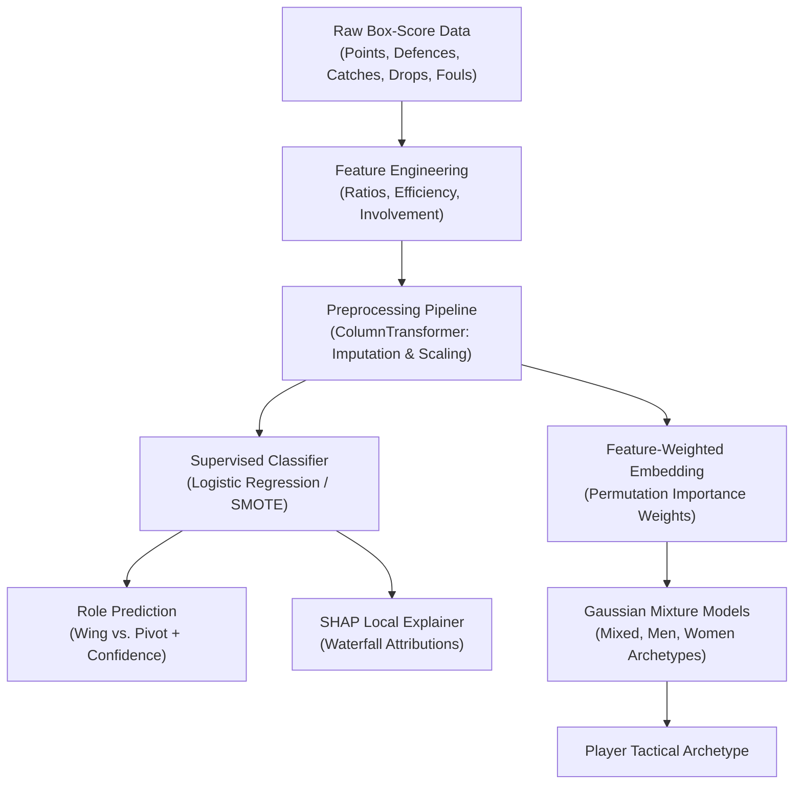

# 🤾 Tchoukball Player Analytics & Role Predictor

[](https://streamlit.io)
[](https://www.python.org/)
[](https://scikit-learn.org/)
[](https://opensource.org/licenses/MIT)

An end-to-end Machine Learning, Explainable AI (XAI), and Unsupervised Clustering system for Tchoukball player scouting, primary role classification (**Wing** vs. **Pivot**), and nuanced archetype profiling across **Mixed**, **Men**, and **Women** competition formats.

---

## 📌 Table of Contents
- [Project Overview](#-project-overview)
- [Domain & Roles](#-domain--roles)
- [Key Features](#-key-features)
- [Architecture & ML Pipeline](#-architecture--ml-pipeline)
  - [Supervised Classification](#1-supervised-role-prediction)
  - [Explainable AI (XAI)](#2-explainable-ai-xai)
  - [Unsupervised Archetype Profiling (GMM)](#3-unsupervised-archetype-clustering)
- [Repository Structure](#-repository-structure)
- [Installation & Setup](#-installation--setup)
- [Running the Streamlit Application](#-running-the-streamlit-application)
- [Identified Bugs & Known Issues](#-identified-bugs--known-issues)
- [Author & Acknowledgments](#-author--acknowledgments)

---

## 📖 Project Overview

Tchoukball is a fast-paced, non-contact team sport played with two rebound frames (trampolines) at opposite ends of the court. While players rotate fluidly between offense and defense, team tactical structures generally rely on specialized duties: attacking the frame (**Wing**) vs. anchoring the court defense and playmaking (**Pivot**).

This project provides:
1. **Predictive Scouting Tool**: Classifies a player's box-score performance into **Wing** or **Pivot** with calibrated probability scores.
2. **Transparent Decision Explanations**: Uses SHAP (SHapley Additive exPlanations) waterfall plots to show exactly which box-score statistics drove each classification decision.
3. **Multi-Category Archetype Profiling**: Fits Gaussian Mixture Models (GMM) with Information Complexity Criteria (ICL/BIC) on feature-weighted spaces to identify nuanced playing styles in Mixed, Men's, and Women's competitions.
4. **Interactive Dashboard**: A Streamlit application (`app/app.py`) for coaches, analysts, and scouts.

---

## 🤾 Domain & Roles

| Role | Primary Responsibilities | Defining Statistical Traits |
| :--- | :--- | :--- |
| **Wing** | Primary attacking threat, shooting at the rebound frames from wide angles | High `SCORED`, high `%SHOT_SCORED`, high `OFF_LOAD_SHARE`, positive `NET_POINTS` |
| **Pivot** | Defensive anchor, court distribution, picking up frame rebounds | High `DEFENCE`, high `CAUGHT`, low `DROPPED`, high `CATCH_EFFICIENCY` |

In international competitions, Tchoukball is contested in **Mixed**, **Men's**, and **Women's** divisions. Because physical dynamics and tactical spacing vary across formats, clustering models are trained both globally and format-specifically.

---

## ✨ Key Features

- **Standard vs. Advanced Metrics**: Switch between raw box-score counts and derived domain ratios (`OFF_DEF_RATIO`, `CATCH_EFFICIENCY`, `NET_POINTS`, `OFF_LOAD_SHARE`, `ERROR_PRONENESS`).
- **Explainable Machine Learning**: Real-time SHAP waterfall charts revealing positive and negative feature attributions for every individual player.
- **Radar Silhouette Chart**: Visual representation of the player's statistical footprint.
- **Probabilistic Archetype Assignment**: Categorizes players into tactical archetypes (e.g., *Defensive specialist*, *Master of the game*, *High-usage offensive player*, *Playmaker prone to errors*).

---

## ⚙ Architecture & ML Pipeline



### 1. Supervised Role Prediction
- **Preprocessing**: `ColumnTransformer` with median imputation and `StandardScaler` for volumetric/ratio features, constant imputation (`0`) for shooting percentage, and most-frequent imputation for gender.
- **Model Selection**: Evaluated using nested cross-validation across Logistic Regression, Perceptron, $k$-NN, Random Forest, and XGBoost with SMOTE/RandomOverSampler and dimensionality reduction (PCA/LDA/SFS).
- **Final Model**: L1/L2-regularized **Logistic Regression** pipeline yielding robust generalization and native probability calibration.

### 2. Explainable AI (XAI)
- **Global Importance**: Permutation importance on the holdout test set and SHAP summary/beeswarm plots.
- **Marginal Effects**: Partial Dependence Plots (PDP) illustrating non-linear role probability transitions.
- **Local Interpretability**: SHAP linear explainer generates per-player waterfall plots explaining single-game predictions.

### 3. Unsupervised Archetype Clustering
- Evaluates Gaussian Mixture Models (GMM) with full covariance matrices.
- Features are scaled and weighted by permutation feature importances: $X_{\text{weighted}} = X_{\text{scaled}} \odot \sqrt{w}$.
- Number of clusters $k$ was determined via Integrated Completed Likelihood (ICL) minimization and domain interpretability:
  - **Mixed Format**: 5 or 6 archetypes
  - **Men's Format**: 5 or 6 archetypes
  - **Women's Format**: 4 or 5 archetypes

---

## 📁 Repository Structure

```text
tchoukball_RolePrediction/
├── app/
│   ├── app.py                      # Streamlit interactive scouting application
│   └── archetype_dictionaries.py   # Text descriptions for GMM cluster IDs
├── data/
│   └── DFML1.csv                   # Historical match box-score dataset
├── models/
│   ├── trained_pipeline.joblib            # Base scikit-learn classification pipeline
│   ├── trained_pipeline_advanced.joblib   # Advanced classification pipeline
│   ├── gmm_archetypes.joblib              # Mixed category base GMM
│   ├── gmm_advanced_archetypes.joblib     # Mixed category advanced GMM
│   ├── gmm_m_archetypes.joblib            # Men's category base GMM
│   ├── gmm_advanced_m_archetypes.joblib   # Men's category advanced GMM
│   ├── gmm_w_archetypes.joblib            # Women's category base GMM
│   ├── gmm_advanced_w_archetypes.joblib   # Women's category advanced GMM
│   ├── weights.npy                        # Feature weighting vector (base)
│   └── weights_advanced.npy               # Feature weighting vector (advanced)
├── notebooks/
│   └── TchoukballRolePrediction.ipynb     # Full development & training notebook
└── requirements.txt                       # Project Python dependencies
```

---

## 🚀 Installation & Setup

### Prerequisites
- Recommended: **Python 3.10, 3.11, or 3.12** *(Python 3.14 is currently not recommended due to pre-compiled C-extension wheel availability)*.

### 1. Clone the repository
```bash
git clone https://github.com/JackColombo/tchoukball_RolePrediction.git
cd tchoukball_RolePrediction
```

### 2. Create and activate a virtual environment
- **macOS / Linux**:
  ```bash
  python -m venv venv
  source venv/bin/activate
  ```
- **Windows (PowerShell)**:
  ```powershell
  python -m venv venv
  .\venv\Scripts\Activate.ps1
  ```

### 3. Install required packages
```bash
pip install -r requirements.txt
```

---

## 🖥 Running the Streamlit Application

Start the web dashboard locally:

```bash
streamlit run app/app.py
```

Once running, navigate to `http://localhost:8501` in your browser. Enter box-score values for a match (or player averages), toggle advanced metrics, and click **Predict Role & Analyze Player**.

---

## 👤 Author & Acknowledgments

- **Author**: Giacomo Colombo ([@GiacomoColomboo](https://github.com/GiacomoColomboo))
- **Project**: Final Project for *Machine Learning, Artificial Neural Network and Deep Learning (Mod. 1)*.
- **Data Source**: Official match statistics collected from European and international Tchoukball competitions.
